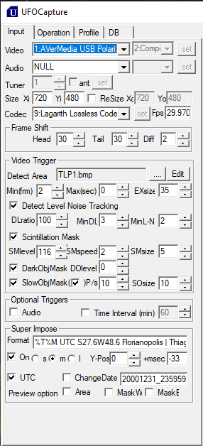

# Timelapse

Geração de timelapses com arquivos via linha de comando (Windows)

## Configuração

Copiar o arquivo timelapse.bat para algum diretório local, ex.: c:\bramon\tools.

Caso o _ffmpeg_ não esteja em seu caminho padrão (c:\bramon\tools), editar a variável *ffmpeg_path*.

Configurar o UFOCapture para ativar a captura com intervalos, selecionando *Time interval* na sessão *Optional triggers*, e inserir o intervalo das capturas.



## Uso

```console
timelapse.bat [diretorio_origem] [extensão]
```

- *diretorio_origem*: localização dos arquivos de origem. Ex.: c:\bramon\!data\TLP1\2021\202103\20210321\
- *extensão*: extensão para gerar o timelapse, o padrão é *jpg*, mas pode ser utilizado *avi* (mais demorado)

### Exemplos de uso

Abra um terminal de comando (prompt do MS-DOS, ou Windows Terminal) e digite os comandos:

```console
c:\bramon\tools\timelapse.bat c:\bramon\!data\TLP1\2021\202103\20210321\
```

```console
c:\bramon\tools\timelapse.bat c:\bramon\!data\TLP1\2021\202103\20210321\ jpg
```

```console
c:\bramon\tools\timelapse.bat c:\bramon\!data\TLP1\2021\202103\20210321\ avi
```

Será gerado como resultado, um arquivo *timelapse.mp4* no diretório corrente.
